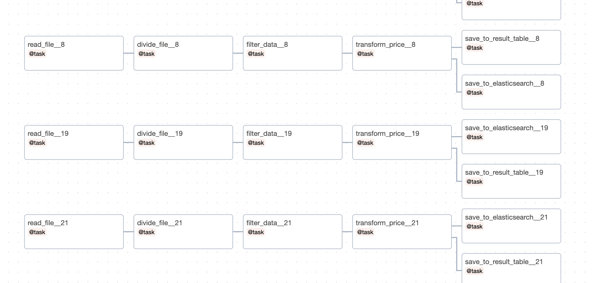
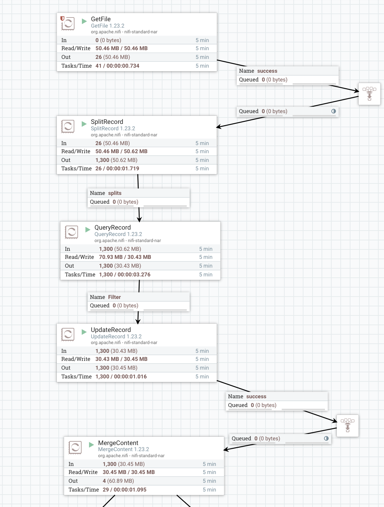
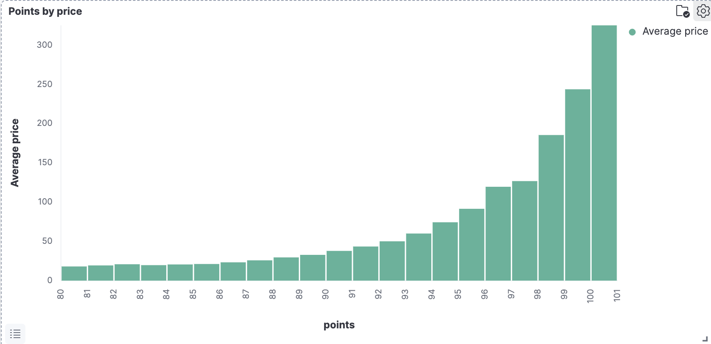

# AirFlow

# Nifi

## Проблемы

- отсутствие примеров флоу
- неочевидные ошибки
  - из очереди не брались элементы, ошибка 'query prediction is not configured', починилось построением и запуском флоу заново с нуля
  - для того чтобы работали reader и writer необходимо было добавить их в controller services, что не описано на основной странице документации
- не удобный функционал, для перехода между шагами нужно останавливать/включать модуль
- при повторном запуске нужно заново складывать данные для обработки

# Kibana
